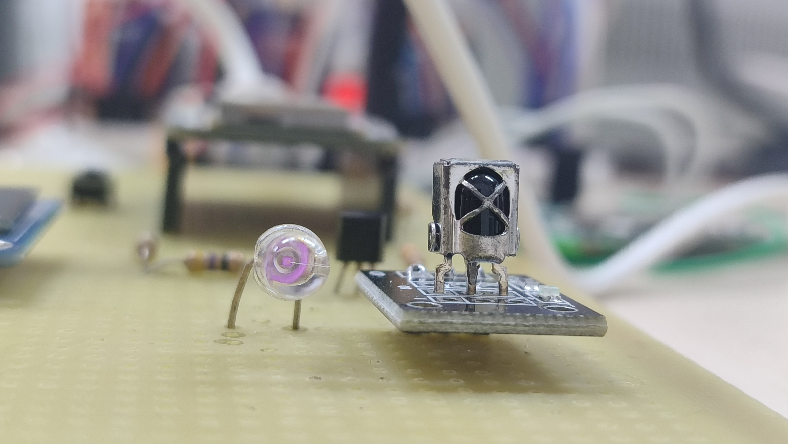
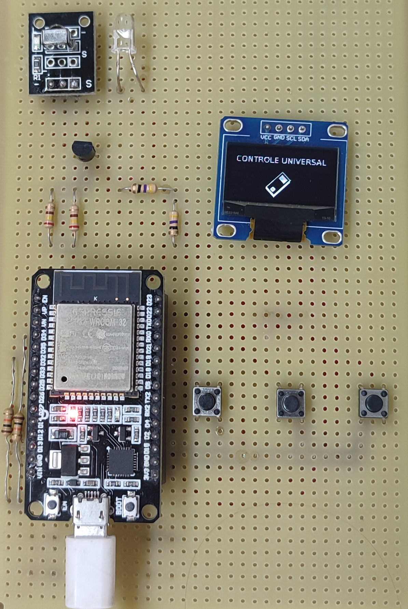

# ESP32 IR Universal Remote 

This project enables an ESP32 to capture and replicate infrared (IR) signals from various remote controls. Utilizing the [Arduino-IRremote](https://github.com/Arduino-IRremote/Arduino-IRremote) library, the system can learn IR signals and retransmit them, effectively emulating the original remote's functionality, it also integrates an user interface using a 128x64 OLED Display.

## 🔧 Features

- **IR Signal Learning**: Captures IR signals using a receiver module and decodes them for analysis.
- **Signal Reproduction**: Re-transmits the learned IR signals through an IR LED, allowing the ESP32 to mimic remote controls.
- **Protocol Support**: Currently supports Pulse Distance protocols, with plans to expand compatibility.
- **OLED Display**: The system supports a 128x64 OLED Display.

## 🚀 Future Enhancements

- **Extended Protocol Compatibility**: Future work seeks to make an option for the user to receive and send signals from all protocols supported by the library.
- **EEPROM Storage**: Currently working on EEPROM storage to allow the user to store IR signals in the ESP32 memory.

## 🛠️ Getting Started

### Prerequisites

- **Hardware**:
  - ESP32-WROOM-32;
  - IR receiver module (e.g., TSOP38238);
  - IR LED for transmission;
  - 128x64 OLED Display;
  - 3 x Push-buttons;
  - 2N2222a Transistor;
  - 2 x 47 Ohm Resistors;
  - 2 x 300 Ohm Resistors;
  - 3 x 10k Ohm Resistors

- **Software**:
  - [Arduino IDE](https://www.arduino.cc/en/software)
  - [Arduino-IRremote Library](https://github.com/Arduino-IRremote/Arduino-IRremote)
  - [Adafruit-GFX-Library](https://github.com/adafruit/Adafruit-GFX-Library)
  - [Adafruit_SSD1306](https://github.com/adafruit/Adafruit_SSD1306)

## 🤖 Initial Prototype

An initial prototype was already made and soldered in a perf board, and a case housing for the circuit.

  
  

## 📦 3D Printed Enclosure

To house the prototype, a custom 3D-printed enclosure was designed. This case provides protection for the electronic components and a clean, organized look for the device, while also integrating the OLED display and push-buttons for user interaction. The design includes cutouts for the IR LED and receiver module, ensuring optimal performance.

